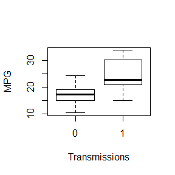
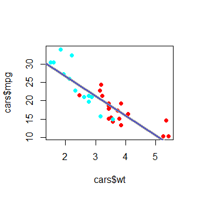
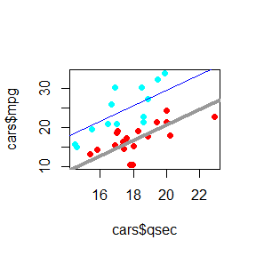
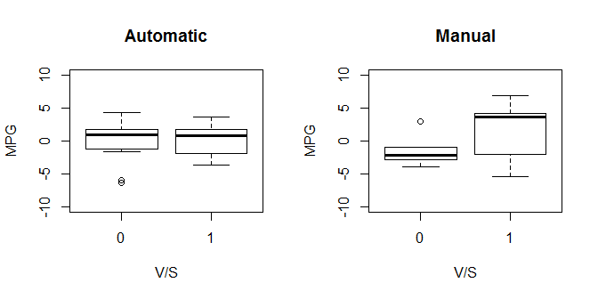

# Automatic or Manual Transmissions - Which is Better?
Chuan Zhang


## Executive Summary

This report tries to clarify, automatic and manual transmissions, which one is better for MPG, by quantifying the MPG differences between the two transmissions. The data set <code>mtcars</code> is used for the regression modeling and analysis. This report is organized as follows. In the second section, an exploratory analysis of the data set is implemented. In the third section, several regression models are built based on the exploratory analysis in the second section. In the fourth section, we conclude the report by answering the question.

## Exploratory Data Analysis

### Preliminary Analysis
First, we check if the two types of cars in general are different in MPG or not.

```r
data(mtcars); aggregate(mtcars$mpg,list(mtcars$am),summary)
```

```
##   Group.1 x.Min. x.1st Qu. x.Median x.Mean x.3rd Qu. x.Max.
## 1       0  10.40     14.95    17.30  17.15     19.20  24.40
## 2       1  15.00     21.00    22.80  24.39     30.40  33.90
```

From Figure 1, we can see that it seems the two types of cars are different, and the manual cars are better than automatic cars in terms of MPG. However, we could not conclude yet, as we did not consider any of the other features, which may bias the results. To clarify if our observation from this preliminary result is true or not, we first clarify which features are relevant.

### Selecting Explanatory Variables
First, we assume that the MPG variable depends on all variables, then the \textbf{variance inflation factor}, $VIF$, can be computed as follows


```r
data(mtcars); cars <- mtcars; cars$cyl <- factor(cars$cyl)
cars$vs <- factor(cars$vs); cars$am <- factor(cars$am)
cars$gear <- factor(cars$gear); cars$carb <- factor(cars$carb)
model0 <- lm(mpg ~ ., data = cars); library(car); sqrt(vif(model0)[,1])
```

```
##       cyl      disp        hp      drat        wt      qsec        vs 
## 11.319053  7.769536  5.312210  2.609533  4.881683  3.284842  2.843970 
##        am      gear      carb 
##  3.151269  7.131081 22.432384
```

Clearly, all variables except for the four variables, \emph{drat}, \emph{qsec}, \emph{vs} and \emph{am}, have very large \emph{VIF} values, which suggested that these variables may be redundant. Next, we use the backward predictor selection method to check if they are redundant or not, and if they are, then remove them to get the model we need to address our project question.


```r
model1 <- lm(mpg ~ am + qsec + vs + drat + wt + disp + hp + gear + carb, data=cars)
model2 <- lm(mpg ~ am + qsec + vs + drat + wt + disp + hp + gear, data=cars)
model3 <- lm(mpg ~ am + qsec + vs + drat + wt + disp + hp, data=cars)
model4 <- lm(mpg ~ am + qsec + vs + drat + wt + disp, data=cars)
model5 <- lm(mpg ~ am + qsec + vs + drat + wt, data=cars)
model6 <- lm(mpg ~ am + qsec + vs + drat, data=cars)
model7 <- lm(mpg ~ am + qsec + vs, data=cars)
model8 <- lm(mpg ~ am + qsec, data=cars)
model9 <- lm(mpg ~ am, data=cars)
pvalues <- anova(model0,model1,model2,model3,model4,model5,model6,model7,model8,model9)[,6]
pvalues <- round(pvalues,3); pvalues <- as.data.frame(t(pvalues))
colnames(pvalues) <- c('None','cyl','carb','gear','hp','disp','wt','drat','vs','qsec')
rownames(pvalues) <- c('p-val'); pvalues
```

```
##       None   cyl  carb  gear    hp  disp    wt  drat    vs qsec
## p-val   NA 0.521 0.855 0.837 0.207 0.468 0.001 0.208 0.049    0
```
The $p$-value result confirms our $VIF$ values analysis except that we need keep the variable $wt$ and remove $drat$. In next section, we compare the difference of cars in $mpg$ with different transmissions.

## Data Analysis

### $mpg$ Difference in terms of $wt$

```r
wtFit <- lm(mpg ~ wt + am, data=cars); wtFit0<- lm(mpg ~ wt, data=cars)
anova(wtFit,wtFit0)[2,6] # Pr(>F), i.e. p-value
```

```
## [1] 0.9879146
```
Clearly, in terms of $wt$, cars with different transmissions are not different in $mpg$. Figure 2 confirms our result here.

### $mpg$ Difference in terms of $qsec$

```r
qsecFit <- lm(mpg ~ qsec + am, data=cars); qsecFit0<- lm(mpg ~ qsec, data=cars)
anova(qsecFit,qsecFit0)[2,6] # Pr(>F), i.e. p-value
```

```
## [1] 1.461462e-07
```
Both the $p$-value and Figure 3 strongly suggested that cars with different transmissions are very different in $mpg$, in terms of $qsec$.

### $mpg$ Difference in terms of $vs$

```r
## Obtaining residuals
cars <- mtcars; resi_mpg <- resid(lm(mpg ~ qsec + am, data=cars))
ncars <- as.data.frame(cbind(resi_mpg,cars$vs,cars$am))
colnames(ncars) <- c('mpg','vs','am')
## Hypothesis Test
autoMean <- aggregate(ncars[ncars$am==0,]$mpg,list(ncars[ncars$am==0,]$vs),mean)[,2]
autoSd <- aggregate(ncars[ncars$am==0,]$mpg,list(ncars[ncars$am==0,]$vs),sd)[,2]
nav <- length(ncars[(ncars$am==0) & (ncars$vs==0),]$mpg)
nas <- length(ncars[(ncars$am==0) & (ncars$vs==1),]$mpg)
manuMean <- aggregate(ncars[ncars$am==1,]$mpg,list(ncars[ncars$am==1,]$vs),mean)[,2]
manuSd <- aggregate(ncars[ncars$am==1,]$mpg,list(ncars[ncars$am==1,]$vs),sd)[,2]
nmv <- length(ncars[(ncars$am==1) & (ncars$vs==0),]$mpg)
nms <- length(ncars[(ncars$am==1) & (ncars$vs==1),]$mpg)
newAutoSd <- autoSd^2/c(nav,nas); newManuSd <- manuSd^2/c(nmv,nms)
newSd <- sqrt(newAutoSd + newManuSd); newMean <- manuMean - autoMean
pval <- as.data.frame(t(round(pnorm(abs(newMean/newSd),lower.tail=FALSE),3)))
colnames(pval) <- c('vs=0','Vs=1'); rownames(pval) <- c('p-val'); pval
```

```
##        vs=0  Vs=1
## p-val 0.137 0.268
```
Both the $p$-values and Figure 4 suggest that cars with different transmissions are not very different in $mpg$, in terms of $vs$.

## Conclusion
Based on our regression modeling and hypothesis test results, we conclude that cars with different transmissions are different in $mpg$, and manual cars are better than automatic cars. In addition, we analysis indicates that the difference mainly due to $qsec$ (1/4 mile time).


## Appendix: Figures and Legends

```r
boxplot(mpg ~ am, data=mtcars,outline=TRUE,xlab = "Transmissions",ylab = "MPG")
```

 

Figure 1. Direct comparison between $mpg$ of cars with automatic ($am=0$, left) and manual ($am=1$, right) transmissions.


```r
cars <- mtcars; cars$cyl <- factor(cars$cyl)
cars$vs <- factor(cars$vs); cars$am <- factor(cars$am)
cars$gear <- factor(cars$gear); cars$carb <- factor(cars$carb)
mycol = rainbow(2); plot(cars$mpg ~ cars$wt, pch=19, col=mycol[cars$am])
abline(c(wtFit$coeff[1], wtFit$coeff[2]),lwd='4',col='gray60')
abline(c(wtFit$coeff[1]+wtFit$coeff[3], wtFit$coeff[2]),lwd='1',col='blue')
```

 

Figure 2. Comparison of $mpg$ between cars with automatic (light blue) and manual (red) transmissions in terms of $wt$ and regression lines (automatic: gray thick, manual: blue thin)


```r
mycol = rainbow(2)
plot(cars$mpg ~ cars$qsec, pch=19, col=mycol[cars$am])
abline(c(qsecFit$coeff[1], qsecFit$coeff[2]),lwd='4',col='gray60')
abline(c(qsecFit$coeff[1]+qsecFit$coeff[3], qsecFit$coeff[2]),lwd='1',col='blue')
```

 

Figure 3. Comparison of $mpg$ between cars with automatic (light blue) and manual (red) transmissions in terms of $qsec$ and regression lines (automatic: gray thick, manual: blue thin)


```r
par(mfcol=c(1,2))
boxplot(ncars[ncars$am==0,]$mpg ~ ncars[ncars$am==0,]$vs, outline=TRUE,
        main = "Automatic", xlab = "V/S", ylab = "MPG", ylim = c(-10, 10))
boxplot(ncars[ncars$am==1,]$mpg ~ ncars[ncars$am==1,]$vs, outline=TRUE,
        main = "Manual", xlab = "V/S", ylab = "MPG", ylim = c(-10, 10))
```

 

Figure 4. Comparison residual of $mpg$ after the variation accounted by $qsec$ is removed between cars with automatic (left) and manual (right) transmissions in terms of $vs$ ($vs=0$ left, $vs=1$ right).

